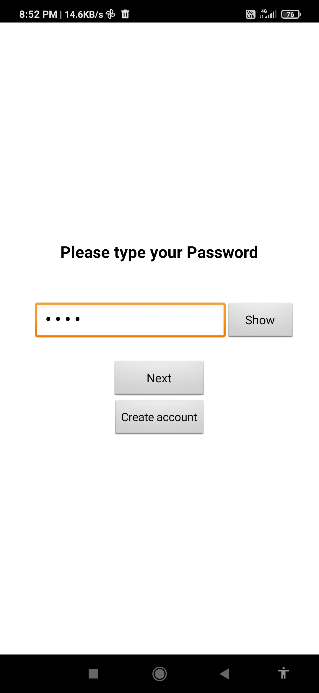
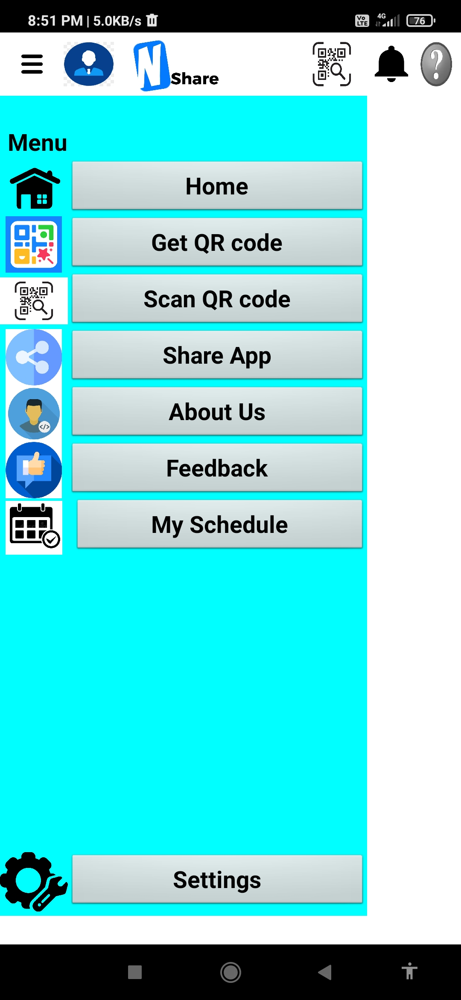

# NShare

<div align="center">
  
  
  **A Modern Application for Connectivity and File Sharing**
  
  [](LICENSE)
  [](https://github.com/Aruvi-B/Nshare)

</div>

---

## 📋 Table of Contents

- [Overview](#overview)
- [Features](#features)
- [Getting Started](#getting-started)
- [Application Screens](#application-screens)
- [Project Structure](#project-structure)
- [Contact](#contact)

---

## 🎯 Overview

**NShare** is an innovative application designed to enhance connectivity and streamline file sharing across devices. Built with a focus on user experience and reliability, NShare provides a seamless platform for sharing, scheduling, and managing file downloads with an intuitive interface.

The project combines modern connectivity solutions with a user-friendly design to make file sharing simple, secure, and efficient.

---

## ✨ Features

- **🔐 Secure Login System** - User authentication and account management
- **📁 File Sharing** - Share files effortlessly with others
- **📅 Schedule Downloads** - Plan your downloads for optimal performance
- **📊 Intuitive Dashboard** - Clean and organized menu interface
- **🔗 QR Code Support** - Quick connection via QR code scanning
- **💬 User Feedback** - Built-in feedback system for continuous improvement
- **📱 Responsive Design** - Works seamlessly across different devices

---

## 🚀 Getting Started

### Prerequisites

- Basic understanding of the application workflow
- A device with the application installed
- Internet connectivity for sharing features

### Quick Start

1. **Launch the Application** - Open NShare on your device
2. **Login** - Enter your credentials on the login page
3. **Navigate the Menu** - Access all features from the main menu
4. **Start Sharing** - Begin sharing files using the intuitive interface
5. **Schedule Downloads** - Set up download schedules as needed

---

🖼️ Application Screens

<div align="center">

Application Interface

<table> <tr> <td align="center">  <br> <b>Login</b> </td> <td align="center">  <br> <b>Main Menu</b> </td> <td align="center">  <br> <b>First Page</b> </td> <td align="center">  <br> <b>Schedule</b> </td> </tr>

<tr> <td align="center">  <br> <b>Scheduled Download</b> </td> <td align="center">  <br> <b>Scan QR</b> </td> <td align="center">  <br> <b>Feedback</b> </td> <td></td> </tr> </table>

</div>

## 📁 Project Structure

```
Nshare/
├── README.md                      # Project documentation
├── LICENSE                        # MIT License
├── NSHARE ABSTRACT.pdf           # Technical documentation
├── Nshare.ppt                    # Project presentation
├── Team Nshare.pptx              # Team presentation
├── NSHARE LOGO.jpg               # Application logo
├── Login.jpg                     # Login screen mockup
├── First Page.jpg                # Initial interface
├── Menu.jpg                      # Main menu interface
├── Schedule Page.jpg             # Schedule management screen
├── Schedule Downloading.jpg       # Download scheduling
├── Scan QR.jpg                   # QR code scanning
├── Nshare.apk                   # Appication File
└── Feedback Page.jpg             # Feedback interface
```

---

## 📄 License

This project is licensed under the **MIT License** - see the [LICENSE](LICENSE) file for details.

The MIT License is a permissive open-source license that allows you to:
- ✅ Use commercially
- ✅ Modify the code
- ✅ Distribute the software
- ✅ Use privately

With the condition that:
- 📌 The license and copyright notice are included

---

## 📚 Additional Resources

- **[Project Abstract](NSHARE%20ABSTRACT.pdf)** - Detailed technical specifications and overview
- **[Presentation](Nshare.ppt)** - Comprehensive project presentation
- **[Team Presentation](Team%20Nshare.pptx)** - Team information and credits

---

## 📞 Contact & Support

For questions, support, or collaboration opportunities:

- **GitHub**: [@Aruvi-B](https://github.com/Aruvi-B)
- **Repository**: [Aruvi-B/Nshare](https://github.com/Aruvi-B/Nshare)

---

## 🌟 Acknowledgments

- Thank you to all contributors and team members
- Special appreciation for users who provide valuable feedback
- MIT License for providing an open framework for development

---

</div>
